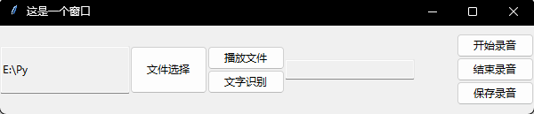

# 总览
## 语音与文字

### 库的安装和使用

#### 借助PyCharm

在文件->设置->项目->Python解释器中找到软件包区域
点击**+**在网络中搜索需要的软件包。

#### pip install

使用 `pip install [需要安装的库]` 语句进行安装。

#### 下载.whl文件

在第三方网站如：
[Python非官方扩展库文件下载](https://www.lfd.uci.edu/~gohlke/pythonlibs/ "Python非官方扩展库文件下载")
[Python库文件镜像](https://pypi.org/simple/ "Python库文件镜像")
寻找.whl文件资源并下载
完成下载后，在下载目录内使用命令行语句

```shell
pip install [文件名]
```

进行安装。

### 文字转语音

**pyttsx3**是**Python**中的文本到语音转换库。与其他库不同，它可以脱机工作，并且与Python 2和3兼容。

可以使用pyttsx3自带的 `speak`语句进行文字转语音的朗读，或获取pyttsx3的引擎使用 `say`语句进行朗读，并使用 `runAndWait`语句开始。

```python
import pyttsx3

# 使用speak进行朗读
pyttsx3.speak('朗读内容')

# 获取pyttsx3语音引擎
speaker = pyttsx3.init()
speaker.say(text, "speak.wav")
speaker.runAndWait()
```

使用pyttsx3还可以使用 `save_to_file`语句将文字转换的语音保存在.wav的文件内。

```python
import pyttsx3

# 保存音频文件
speaker = pyttsx3.init()
speaker.save_to_file(text, "speak.wav")
speaker.runAndWait()
```

获取pyttsx3的语音引擎后可以修改音量、语速、语音等。

```python
import pyttsx3

# 保存音频文件
engine.setProperty('rate', 100)   #设置语速
engine.setProperty('volume',0.6)  #设置音量
voices = engine.getProperty('voices') 
engine.setProperty('voice',voices[0].id)   #设置语音
```

语音可以在通过下载其他语音包来获取。


### 语音转文字

使用 `speechrecognition`完成语音识别。

使用 `pip install`语句进行安装。

```shell
pip install speechrecognition
pip install pocketsphinx
```

其中 `pocketsphinx`可能需要在[Python非官方扩展库文件下载](https://www.lfd.uci.edu/~gohlke/pythonlibs/ "Python非官方扩展库文件")下载。

```python
def rec_audio(file):
    """
    :param: 音频文件路径 : str
    :return: 识别到的内容 : str
    """
    r = sr.Recognizer()
    with sr.AudioFile(file) as source:
        audio = r.record(source)
    try:
        return r.recognize_google(audio, language='zh-CN')
    except Exception as e:
        print(e)
```

`recognize_sphinx`语句可以进行离线识别，但识别~~准确率较低~~几乎识别不出来。

`recognize_google`语句可以进行识别，但由于谷歌无法访问，需要将 处的 `google.com`改为 `google.cn`。

### 创建图形界面

使用tkinter库，为上述功能创建图形化界面。



录音功能可以借助 `pyaudio`库完成，文件的选择和保存借助 `tkinter.filedialog`内的
`askopenfilename`和 `asksaveasfilename`完成。

```python
class Recorder:
    def __init__(self, chunk=1024, channels=1, rate=16000):
        self.CHUNK = chunk
        self.FORMAT = pyaudio.paInt16
        self.CHANNELS = channels
        self.RATE = rate
        self._running = True
        self._frames = []
        self.file = "test.wav"

    def start(self):
        threading._start_new_thread(self._recording, ())

    def _recording(self):
        self._running = True
        print('start recording')
        self._frames = []
        p = pyaudio.PyAudio()
        stream = p.open(format=self.FORMAT,
                        channels=self.CHANNELS,
                        rate=self.RATE,
                        input=True,
                        frames_per_buffer=self.CHUNK)
        while self._running:
            data = stream.read(self.CHUNK)
            self._frames.append(data)

        stream.stop_stream()
        stream.close()
        p.terminate()

    def save(self):
        p = pyaudio.PyAudio()

        wf = wave.open(self.savePath(), 'wb')
        wf.setnchannels(self.CHANNELS)
        wf.setsampwidth(p.get_sample_size(self.FORMAT))
        wf.setframerate(self.RATE)
        wf.writeframes(b''.join(self._frames))
        wf.close()

    def savePath(self):
        path_ = asksaveasfilename(title='保存一个.wav文件', initialdir='/',
                                  filetypes=[('Wave File', '*.wav')])
        if path_ == "":
            self.savePath(self)
        else:
            path_ = path_.replace("/", "\\")
            return path_

    def stop(self):
        self._running = False
        print('stop')

    def play_audio(self, filename=""):
        CHUNK = 1024
        if filename == "":
            filename = self.file
        wf = wave.open(filename, 'rb')
        data = wf.readframes(CHUNK)
        p = pyaudio.PyAudio()

        FORMAT = p.get_format_from_width(wf.getsampwidth())
        CHANNELS = wf.getnchannels()
        RATE = wf.getframerate()

        # print('FORMAT: {} CHANNELS: {} RATE: {}'.format(FORMAT, CHANNELS, RATE))

        stream = p.open(format=FORMAT,
                        channels=CHANNELS,
                        rate=RATE,
                        frames_per_buffer=CHUNK,
                        output=True)

        while len(data) > 0:
            stream.write(data)
            data = wf.readframes(CHUNK)
```

---

## 图像

### OpenCv

OpenCV是一个基于Apache2.0许可（开源）发行的跨平台计算机视觉和机器学习软件库，可以运行在Linux、Windows、Android和Mac OS操作系统上。它轻量级而且高效——由一系列 C 函数和少量 C++ 类构成，同时提供了Python、Ruby、MATLAB等语言的接口，实现了图像处理和计算机视觉方面的很多通用算法。

OpenCv 提供的读取函数imread可以直接打开大部分格式的图片。

```python
import cv2

cv2.imread(文件名) # 打开文件
cv2.imread(文件名, cv2.IMREAD_GRAYSCALE) # 打开为灰度图
cv2.cvtColor(Mat, 转换格式) # 图片格式转换
cv2.resize(Mat, (h, w)) # 设置尺寸
cv2.GaussianBlur(Mat, (5, 5), 0, 0) # 高斯模糊
# 边缘轮廓
contours, hierarchy = cv2.findContours(b, cv2.RETR_TREE, cv2.CHAIN_APPROX_NONE)
# 绘制轮廓
结果图 = cv2.drawContours(Mat, contours, -1, (0, 0, 255), 2) # -1表示绘制全部轮廓

# 读取摄像机图像并逐帧展示
cam = cv2.VideoCapture(0)
while True:
    ret, img = cam.read()
    imshow('', img)
    if waitKey(1) == 27:
        break
```

### NumPy

NumPy（Numerical Python）是Python的一种开源的数值计算扩展。这种工具可用来存储和处理大型矩阵，比Python自身的嵌套列表（nested list structure)结构要高效的多（该结构也可以用来表示矩阵（matrix）），支持大量的维度数组与矩阵运算，此外也针对数组运算提供大量的数学函数库。

---

## 简单人工智能

### KNN

邻近算法，或者说K最邻近（KNN，K-NearestNeighbor）分类算法是数据挖掘分类技术中最简单的方法之一。所谓K最近邻，就是K个最近的邻居的意思，说的是每个样本都可以用它最接近的K个邻近值来代表。近邻算法就是将数据集合中每一个记录进行分类的方法。

### KMeans

k均值聚类算法（k-means clustering algorithm）是一种迭代求解的聚类分析算法，其步骤是，预将数据分为K组，则随机选取K个对象作为初始的聚类中心，然后计算每个对象与各个种子聚类中心之间的距离，把每个对象分配给距离它最近的聚类中心。聚类中心以及分配给它们的对象就代表一个聚类。每分配一个样本，聚类的聚类中心会根据聚类中现有的对象被重新计算。这个过程将不断重复直到满足某个终止条件。终止条件可以是没有（或最小数目）对象被重新分配给不同的聚类，没有（或最小数目）聚类中心再发生变化，误差平方和局部最小。

---

## 互联网接口调用

### face++ 换脸

Face++作为新一代人工智能开放平台，为开发者提供人脸识别、人像处理、人体识别、文字识别、图像识别等 AI 能力。

打开百度搜索并进入Face++，完成注册后进入控制台。

在控制台界面左侧选择应用管理，新建一个使用应用。

查阅人脸融合即换脸的API文档。

调用API的URL为

https://api-cn.faceplusplus.com/imagepp/v1/mergeface

调用方法为POST

| 参数            | 类型 | 描述                                 |
| --------------- | ---- | ------------------------------------ |
| api_key         | str  | 调用此 API 的 API Key                |
| api_secret      | str  | 调用此 API 的 API Secret             |
| template_base64 | str  | 模板图图片的 Base64 编码二进制文件。 |
| merge_base64    | str  | 融合图的 Base64 编码二进制文件。     |

尝试调用这个API

```python
import cv2
import requests
import json
import base64
import numpy as np


def image_to_base64(image_np, format):
    image = cv2.imencode(format, image_np)[1]
    image_code = str(base64.b64encode(image))[2:-1]
    return image_code


def base64_to_image(base64_code):
    img_data = base64.b64decode(base64_code)
    img_array = np.fromstring(img_data, np.uint8)
    img = cv2.imdecode(img_array, cv2.COLOR_RGB2BGR)
    return img


img1 = cv2.imread('2.jpg')
img2 = cv2.imread('1.png')

img64_1 = image_to_base64(img1, '.jpg')
img64_2 = image_to_base64(img2, '.png')

url_add = 'https://api-cn.faceplusplus.com/imagepp/v1/mergeface'
data = {
    "api_key": "i9ac-ZZMEOWqIlRIiLD3oiR26OpAWM43",
    "api_secret": "wad4LNBj41EiWxreH204QlN6WRaOLUZy",
    "template_base64": img64_1,
    "merge_base64": img64_2,
    "merge_rate": 50
}
# url2 = 'https://api-cn.faceplusplus.com/facepp/v2/beautify'

# data2 = {
#     "api_key": "i9ac-ZZMEOWqIlRIiLD3oiR26OpAWM43",
#     "api_secret": "wad4LNBj41EiWxreH204QlN6WRaOLUZy",
#     "image_base64": img64_2,
#     "filter_type": "sunny"
# }
response1 = requests.post(url_add, data=data)

res_con1 = response1.content.decode('utf-8')
res_dict = json.JSONDecoder().decode(res_con1)
result = res_dict['result']

img = base64_to_image(result)

while True:
    if img is None:
        break
    img = cv2.resize(img, (640, 480))
    cv2.imshow('', img)
    if cv2.waitKey(1) == 27:
        break


```

---
