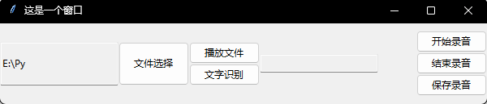

# 界面

## 语音转文字的界面




使用tkinter库，为前几节课的功能创建图形化界面。

```python
import tkinter

win = tkinter.Tk()
win.mainloop()
```

上述代码完成了一个最基本的窗口的创建。

在此基础上，我们还需要为这个空白的窗口添加控件。

```python
import tkinter

win = tkinter.Tk()
win.mainloop()
# 添加框架
frame1 = Frame(win, relief=RAISED, height=200, width=200)
# 添加输入框 设置其位置
Entry(frame1, textvariable=文本变量, state="readonly").pack(side=LEFT, fill=Y)
# 添加按钮 设置其位置
Button(frame1, text="按钮文字", command=函数名).pack(side=LEFT, fill=Y)

除了代码中的控件外，还有很多控件可以添加

```

|                       |                                                                   |
| --------------------- | ----------------------------------------------------------------- |
| Button                | 按钮控件；在程序中显示按钮。                                      |
| Canvas                | 画布控件；显示图形元素如线条或文本                                |
| Checkbutton           | 多选框控件；用于在程序中提供多项选择框                            |
| Entry                 | 输入控件；用于显示简单的文本内容                                  |
| Frame                 | 框架控件；在屏幕上显示一个矩形区域，多用来作为容器                |
| Label                 | 标签控件；可以显示文本和位图                                      |
| Listbox               | 列表框控件；在Listbox窗口小部件是用来显示一个字符串列表给用户     |
| Menubutton            | 菜单按钮控件，用于显示菜单项。                                    |
| Menu                  | 菜单控件；显示菜单栏,下拉菜单和弹出菜单                           |
| Message               | 消息控件；用来显示多行文本，与label比较类似                       |
| Radiobutton           | 单选按钮控件；显示一个单选的按钮状态                              |
| Scale                 | 范围控件；显示一个数值刻度，为输出限定范围的数字区间              |
| Scrollbar             | 滚动条控件，当内容超过可视化区域时使用，如列表框。                |
| Text                  | 文本控件；用于显示多行文本                                        |
| Toplevel              | 容器控件；用来提供一个单独的对话框，和Frame比较类似               |
| Spinbox               | 输入控件；与Entry类似，但是可以指定输入范围值                     |
| PanedWindow           | PanedWindow是一个窗口布局管理的插件，可以包含一个或者多个子控件。 |
| LabelFrame	labelframe | 是一个简单的容器控件。常用与复杂的窗口布局。                      |
| tkMessageBox          | 用于显示你应用程序的消息框。                                      |

其中按钮组件时我们最常用到的一种组件，需要为其关联事件。

如我们在实现语音转文字功能的按钮上就可以将语音转文字的函数与按钮进行关联。

```python
class Windows:
    def __init__(self):
        self.path = None
        self.show = None
        self.re = Recorder()
        self.window = Tk()

    def openPath(self):
        path_ = askopenfilename(title='选择一个.wav文件',
                                filetypes=[('Wave File', '*.wav')])  # 使用askdirectory()方法返回文件夹的路径
        if path_ == "":
            self.path.get()  # 当打开文件路径选择框后点击"取消" 输入框会清空路径，所以使用get()方法再获取一次路径
        else:
            path_ = path_.replace("/", "\\")  # 实际在代码中执行的路径为“\“ 所以替换一下
            self.path.set(path_)

    def rec(self):
        try:
            _path = self.path.get()
            text = self.re.rec_audio(_path)
            self.show.set(text)
        except Exception as e:
            print(e)

    def play(self):
        _path = self.path.get()
        self.re.play_audio(_path)

    def creat_window(self):
        self.window.title("这是一个窗口")
        self.window.geometry("600x100")  # 注意其中的x不是乘号！
        self.path = StringVar()
        self.path.set(os.path.abspath("."))
        self.show = StringVar()
        frame1 = Frame(self.window, relief=RAISED, height=200, width=400)
        frame1.pack(side=LEFT, fill=X)
        frame2 = Frame(self.window, relief=RAISED, height=200, width=200)
        frame2.pack(side=RIGHT, fill=X)
        ttk.Entry(frame1, textvariable=self.path, state="readonly").pack(side=LEFT, fill=Y)
        ttk.Entry(frame1, textvariable=self.show, state="readonly").pack(side=RIGHT)
        ttk.Button(frame1, text="文件选择", command=self.openPath).pack(side=LEFT, fill=Y)
        ttk.Button(frame1, text="文字识别", command=self.rec).pack(side=BOTTOM, fill=BOTH)
        ttk.Button(frame1, text="播放文件", command=self.play).pack(side=BOTTOM, fill=BOTH)

        ttk.Button(frame2, text="保存录音", command=self.re.save).pack(side=BOTTOM, fill=X)
        ttk.Button(frame2, text="结束录音", command=self.re.stop).pack(side=BOTTOM, fill=X)
        ttk.Button(frame2, text="开始录音", command=self.re.start).pack(side=BOTTOM, fill=X)

        # 主窗口循环
        self.window.mainloop()
```

首先，我们需要在窗口内设置Frame，并将各功能实现所需的控件加入各个Frame中。
其中，打开和保存文件的函数可以使用 `askopenfilename`和 `asksaveasfilename`完成。

我们将选择文件的按钮和对应的函数关联起来，获取音频文件的路径。

而后使用 `Recorder`类对象re的函数实现音频播放。

可以使用print或将文本与界面上的文本框实现关联的方式输出语音识别结果。

`Recorder`类的代码，难度过大，可以适当讲解，建议提供代码。

```python
class Recorder:
    def __init__(self, chunk=1024, channels=1, rate=16000):
        self.CHUNK = chunk
        self.FORMAT = pyaudio.paInt16
        self.CHANNELS = channels
        self.RATE = rate
        self._running = True
        self._frames = []
        self.file = "test.wav"

    def start(self):
        threading._start_new_thread(self._recording, ())

    def _recording(self):
        self._running = True
        print('start recording')
        self._frames = []
        p = pyaudio.PyAudio()
        stream = p.open(format=self.FORMAT,
                        channels=self.CHANNELS,
                        rate=self.RATE,
                        input=True,
                        frames_per_buffer=self.CHUNK)
        while self._running:
            data = stream.read(self.CHUNK)
            self._frames.append(data)

        stream.stop_stream()
        stream.close()
        p.terminate()

    def save(self):
        p = pyaudio.PyAudio()

        wf = wave.open(self.savePath(), 'wb')
        wf.setnchannels(self.CHANNELS)
        wf.setsampwidth(p.get_sample_size(self.FORMAT))
        wf.setframerate(self.RATE)
        wf.writeframes(b''.join(self._frames))
        wf.close()

    def savePath(self):
        path_ = asksaveasfilename(title='保存一个.wav文件', initialdir='/',
                                  filetypes=[('Wave File', '*.wav')])  # 使用askdirectory()方法返回文件夹的路径
        if path_ == "":
            self.savePath(self)  # 当打开文件路径选择框后点击"取消" 输入框会清空路径，所以使用get()方法再获取一次路径
        else:
            path_ = path_.replace("/", "\\")  # 实际在代码中执行的路径为“\“ 所以替换一下
            return path_

    def stop(self):
        self._running = False
        print('stop')

    def play_audio(self, filename=""):
        CHUNK = 1024
        if filename == "":
            filename = self.file
        wf = wave.open(filename, 'rb')
        data = wf.readframes(CHUNK)
        p = pyaudio.PyAudio()

        FORMAT = p.get_format_from_width(wf.getsampwidth())
        CHANNELS = wf.getnchannels()
        RATE = wf.getframerate()

        # print('FORMAT: {} CHANNELS: {} RATE: {}'.format(FORMAT, CHANNELS, RATE))

        stream = p.open(format=FORMAT,
                        channels=CHANNELS,
                        rate=RATE,
                        frames_per_buffer=CHUNK,
                        output=True)

        while len(data) > 0:
            stream.write(data)
            data = wf.readframes(CHUNK)

    @staticmethod
    def rec_audio(file):
        """
        :param: The Absolute Path of the audio file
        :return: Content identified
        """
        r = sr.Recognizer()
        with sr.AudioFile(file) as source:
            audio = r.record(source)
        try:
            # print(r.recognize_sphinx(audio, language='zh-CN'))
            # print(r.recognize_google(audio, language='zh-CN'))
            return r.recognize_google(audio, language='zh-CN')
        except Exception as e:
            print(e)
```


上述内容的讲解和学生实践需要2-3课时完成。
